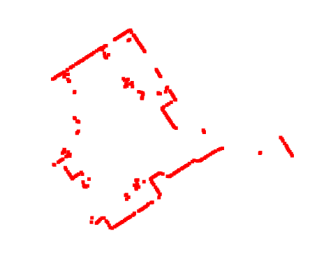

### Modern C++ 2024 Final Project: 2D Lidar odometry in the Real-World

This project implements 2D LiDAR odometry using the ICP (Iterative Closest Point) algorithm. It processes 2D LiDAR scans collected from a moving robot in a corridor. The project employs a KD-Tree based data structure for finding correspondences and offers a modular structure for the ICP algorithm, dataloader, and visualizer.

<!-- TODO: Add if possible GIF of the ICP algorithm-->
<div style="text-align: center;">
    
    <p><em>Figure 1: Single 2D LiDAR scan</em></p>
</div>

## Required Libraries

- Eigen
  - Install with `sudo apt install libeigen3-dev`
- Open3D
  - Visit [Open3d github](https://github.com/isl-org/Open3D/releases)
    - Download file `open3d-devel-linux-x86_64-cxx11-abi-0.18.0.tar.xz` from the Assets section
  - Extract the downloaded ‘tar’ file to the project folder, rename the folder as simply `open3d`

## Project Structure

> NOTE: Keep the all the binary files data in the `BINARY` folder

```plaintext
|-- 2d_lidar_odom_cpp
|   |-- apps
|   |   |-- main.cpp
|   |   |-- CMakeLists.txt
|   |-- BINARY
|   |-- dataloader
|   |   |-- CMakeLists.txt
|   |   |-- dataloader.cpp
|   |   |-- dataloader.h
|   |-- icp
|   |   |-- CMakeLists.txt
|   |   |-- icp.cpp
|   |   |-- icp.hpp
|   |   |-- kdtree.cpp
|   |   |-- kdtree.hpp
|   |-- open3d
|   |   |-- include
|   |   |-- lib
|   |   |-- share
|   |-- viewer
|   |   |-- CMakeLists.txt
|   |   |-- viewer.cpp
|   |   |-- viewer.hpp
|   |-- CMakeLists.txt
|   |-- README.md
|   |-- .gitignore
```

## How to run the project

1. Build the project (from the project root directory)

- `cmake -Bbuild .` - Generates build system files in the build directory
- `cmake --build build` - Compiles the project using the build system files in the build directory

2. Run the project

- `./build/apps/main .`
